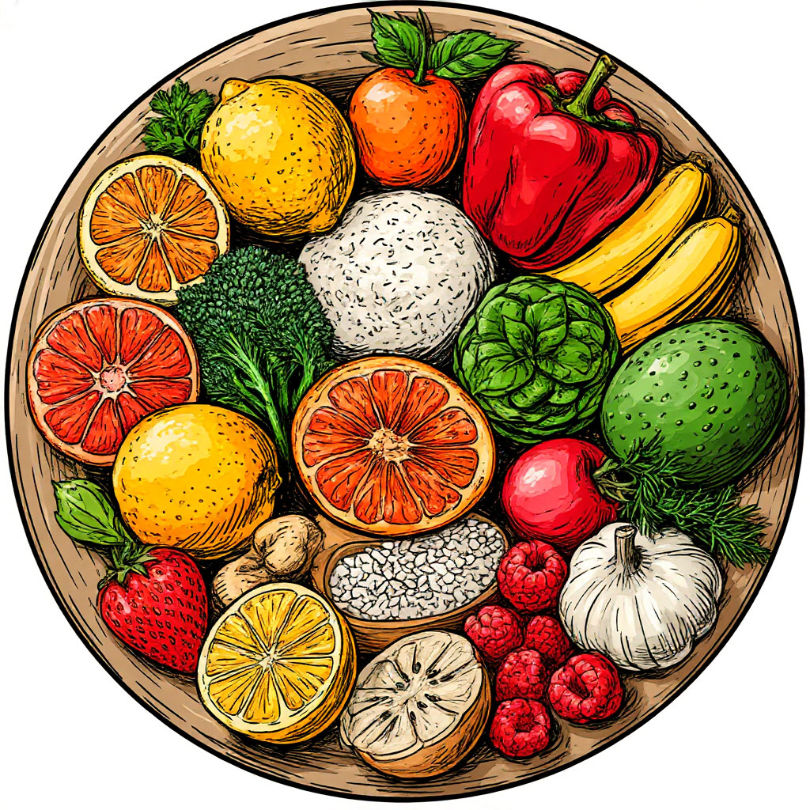
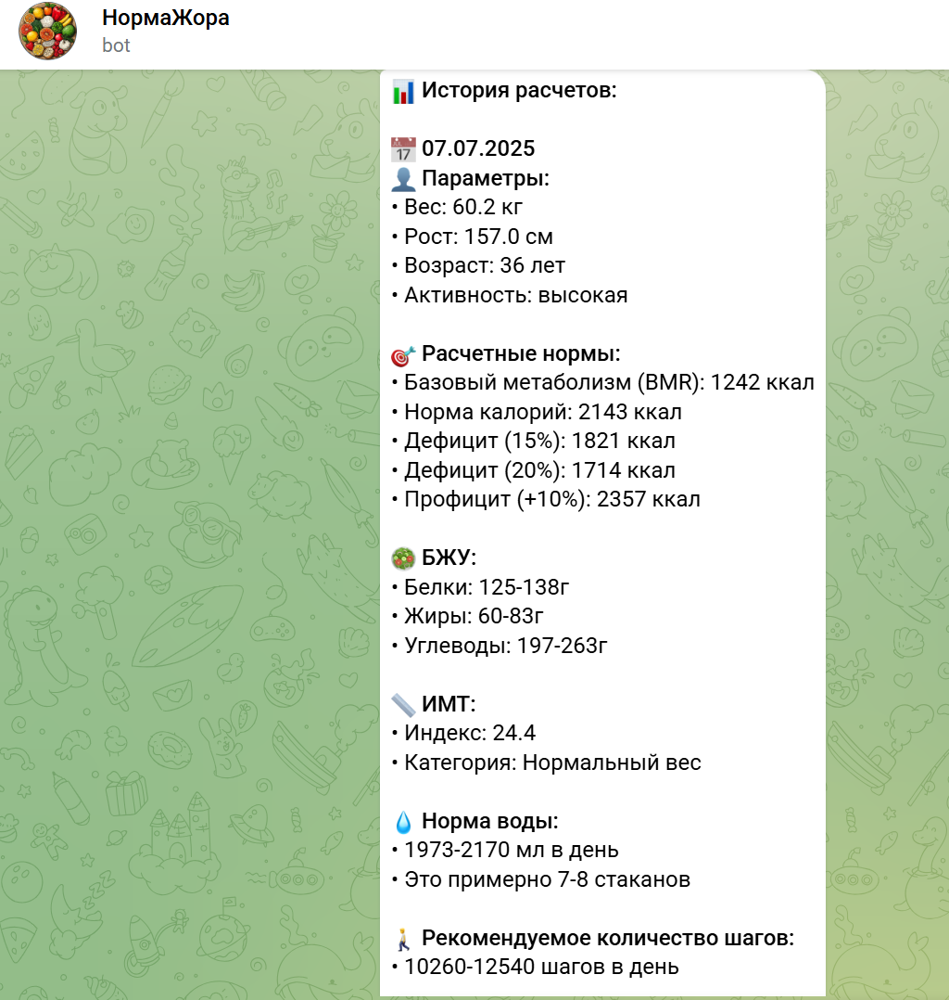

 # НормаЖора

Telegram-бот для расчёта индивидуальных норм питания и поддержки здорового образа жизни.  
Проект был создан с помощью искусственного интеллекта **GPT-4 (OpenAI)** через платформу **Cursor** и предназначен для портфолио.

## Основные возможности

- **Расчёт калорий и макроэлементов:** Индивидуальный подбор суточной нормы калорий, белков, жиров и углеводов.
- **Советы по питанию:** Персональные рекомендации для поддержания здорового образа жизни.
- **Удобный интерфейс:** Простое взаимодействие через Telegram.
- **Расчёт ИМТ:** Учёт возраста и пола пользователя.
- **Планы на будущее:** Добавление карточек с советами, подбор рецептов, планирование питания, отслеживание прогресса.

## Технологии и стек

- **Язык:** Python
- **Бот:** Telegram Bot API (python-telegram-bot)
- **ИИ:** GPT-4 (OpenAI) через платформу Cursor
- **Хранение данных:** SQLite или Firestore
- **Платформа разработки:** Cursor
- **Автоматизация и генерация кода:** Искусственный интеллект

## Скриншоты

<td></td>
